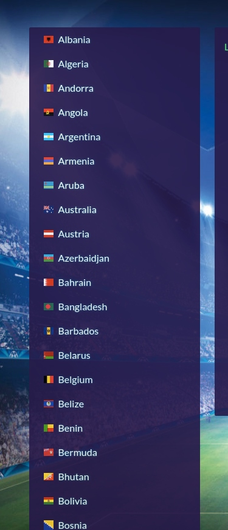
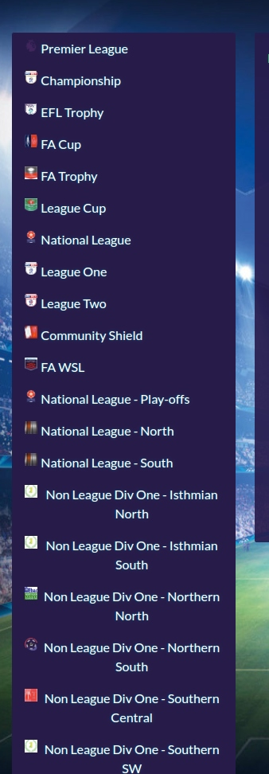
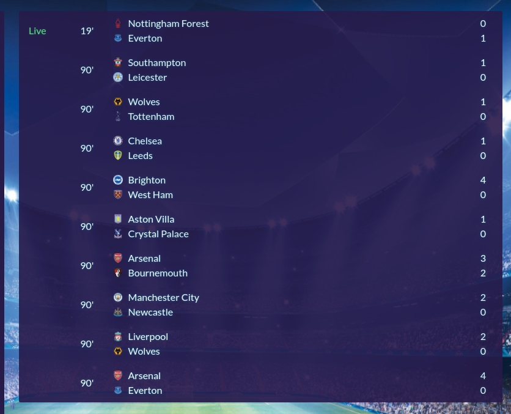
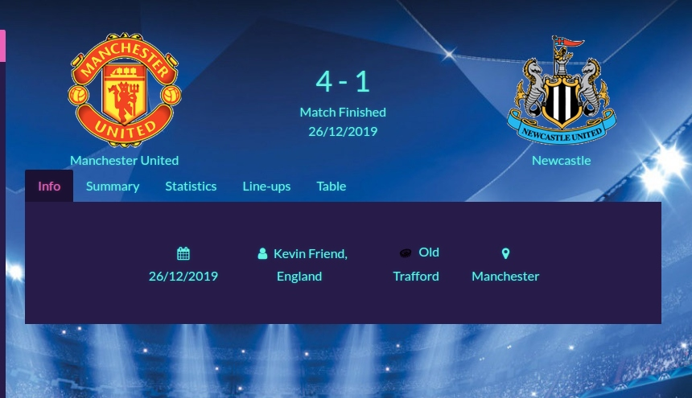
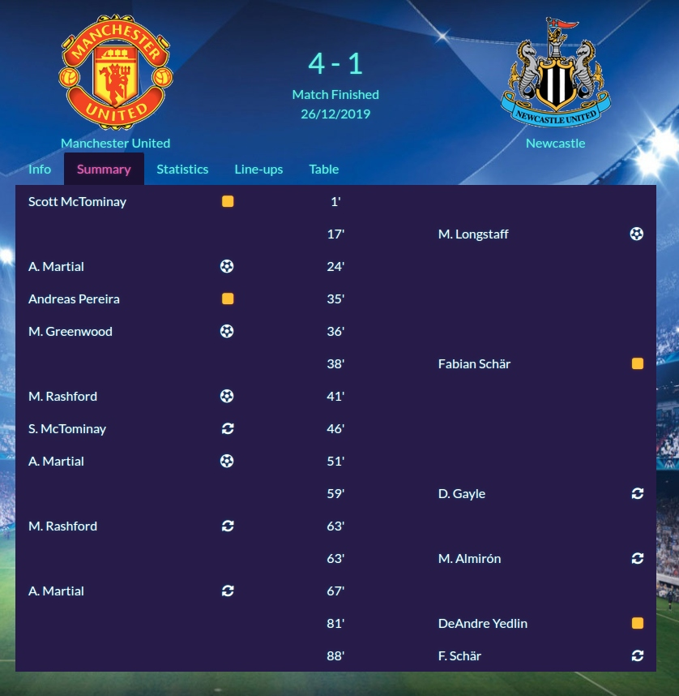
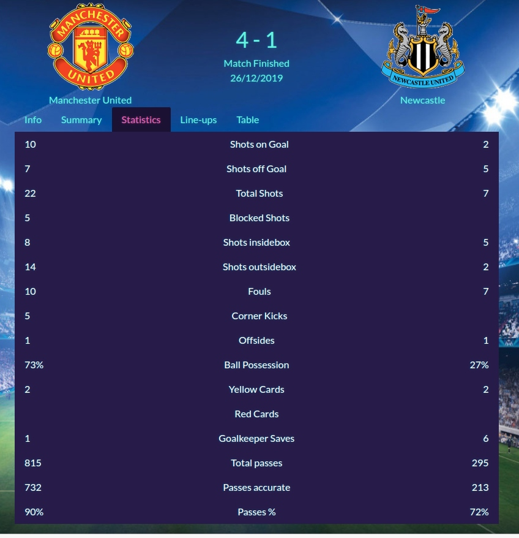
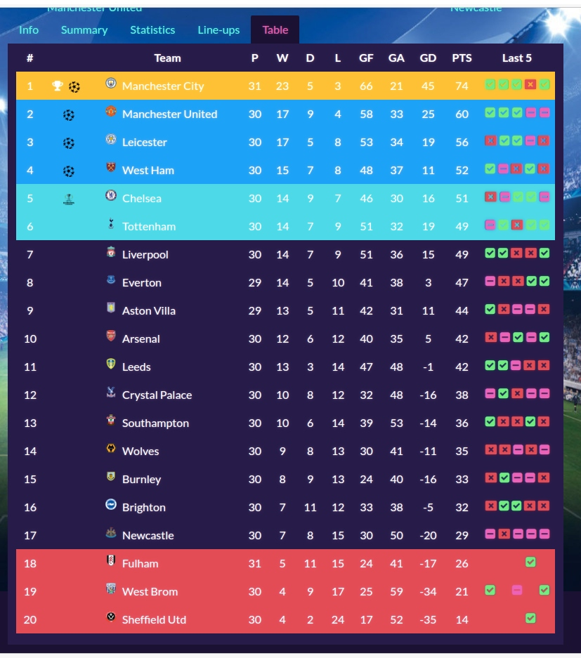

# Please visit the live application here 
https://shraddhamhatre113.github.io/score-app/
### $\color{purple}{CountryListPanel}$  :- 
Significance of this component is you can see countries list with each country name and flag.If click on one of the country from country list it will display league list of the country.

 ### $\color{purple}{LeagueListPanel}$  :- 
 This component will display a leagues list . select league from league list then it will open league details. 
 
 

 ### $\color{purple}{LeftPAnel}$  :- 
 Left panel component is rendering countriespanel and leaguepanel.
 
 

### $\color{purple}{ReightPanel}$  :-
* Right-side-panel component is rendering all fixture details on the right hand side

### $\color{purple}{FixtureList}$  :-
* Fixture-list component is display the details of the league.
 

### $\color{purple}{FixtureDetail}$  :-
* Fixture-detail component is displaying fixture detail of the selected league. 

### $\color{purple}{TabPanel}$  :-
* TabPanel component- fixture list tabs are created in this component.created separate component for each tab.

### $\color{purple}{InfoTabPanel}$  :-
*Info-tab-panel- This component is rendering information of the league.

### $\color{purple}{SummaryTab}$  :-
* Summary-tab-panel - It is displaying summary of the league.

### $\color{purple}{StatisticTab}$  :-
* Statistics panel - It is displaying static data  of the league.

### $\color{purple}{TableTabPanel}$  :-
* Table-tab-panel - This table shows how may matches has the league won,draw matches, goals accepted, points,goal difference, goal against.

  .

## Reference
* https://www.livescore.com/en/ :- took reference from this site to building app
* https://www.api-football.com -for Foot-ball data.
* https://bootstrapstudio.io/ I used this site to build component.
* https://www.npmjs.com/package/react-soccer-lineup?activeTab=readme :- React library for lineup tab.
* https://bootswatch.com/pulse/ :- used this bootstrap theme

